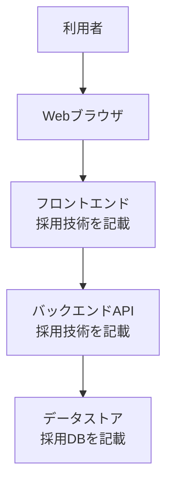
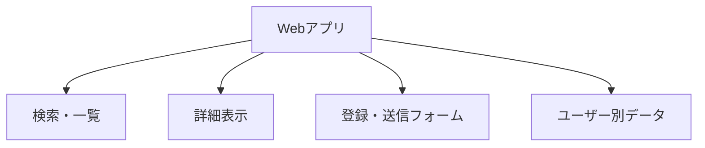
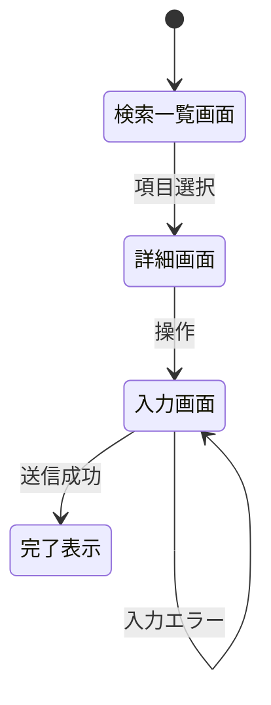
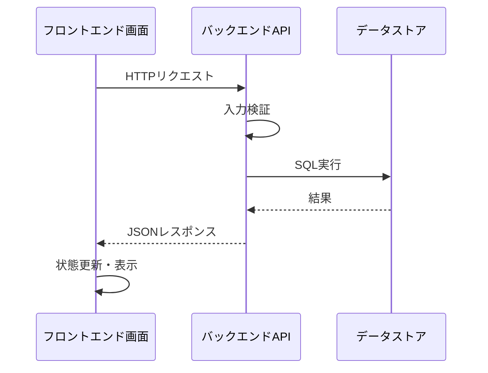
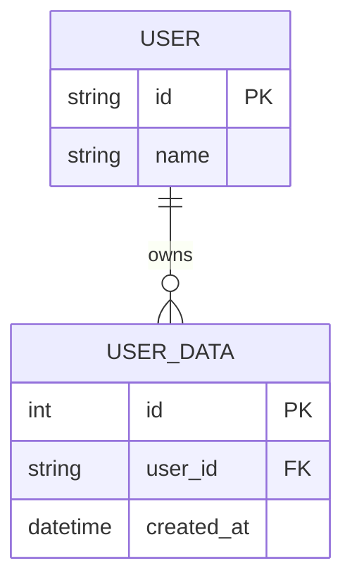
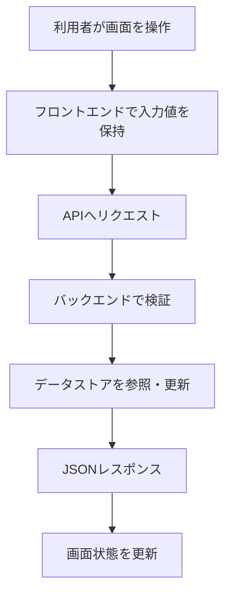

# 基本設計書

## ドキュメント管理情報
| 項目 | 内容 |
|------|------|
| プロジェクト名 | |
| システム名 | |
| 対象機能 | |
| バージョン | |
| 作成日 | |
| 最終更新日 | |
| 作成者 | |
| ステータス | 草案 / レビュー中 / 承認済み |

## 変更履歴
| 日付 | バージョン | 変更内容 | 変更者 |
|------|------------|----------|--------|
| | | | |

---

## 1. 概要

### 1.1 目的
本設計書の目的、対象機能、対象読者を記載する。

### 1.2 スコープ
| 区分 | 内容 |
|------|------|
| 対象範囲 | |
| 対象外 | |
| 前提条件 | |
| 制約条件 | |

### 1.3 関連ドキュメント
| ドキュメント | パス・参照先 | バージョン |
|--------------|--------------|------------|
| 要件定義書 | | |

### 1.4 用語定義
| 用語 | 定義 |
|------|------|
| | |

---

## 2. システム全体構成

### 2.1 システム構成図


### 2.2 技術スタック
| レイヤー | 技術 | バージョン | 用途 | 選定理由 |
|----------|------|------------|------|----------|
| フロントエンド | | | 画面表示・操作 | |
| フロントエンドビルド | | | 開発サーバー・ビルド | |
| バックエンド | | | API・業務処理 | |
| パッケージ管理 | | | 依存管理 | |
| データストア | | | 永続化 | |
| テスト | | | 動作確認 | |

### 2.3 アーキテクチャ方針
- フロントエンドはブラウザ上のUIとAPI呼び出しを担当する。
- バックエンドは入力検証、業務処理、DBアクセス、レスポンス生成を担当する。
- DBはアプリで扱う永続データを保存する。
- 画面、API、DBの責務を分離し、変更影響を追跡しやすくする。

### 2.4 ディレクトリ構成概要
```
project-root/
├── frontend/
│   ├── src/
│   ├── package.json
│   └── package-lock.json
├── backend/
│   ├── app/
│   ├── tests/
│   ├── pyproject.toml
│   └── uv.lock
└── docs/
```

### 2.5 起動・実行方針
| 対象 | コマンド | 用途 |
|------|----------|------|
| バックエンド | | API起動 |
| バックエンドテスト | | APIテスト |
| フロントエンド | | 画面起動 |
| フロントエンドビルド | | ビルド確認 |

---

## 3. 機能設計

### 3.1 機能一覧
| 機能ID | 機能名 | 概要 | 優先度 | 要件ID | 関連画面 | 関連API |
|--------|--------|------|--------|--------|----------|---------|
| F001 | | | 高/中/低 | REQ-xxx | SCxxx | APIxxx |

### 3.2 機能構成図


### 3.3 機能詳細

#### 3.3.1 [機能名]
- **機能ID**: F001
- **概要**:
- **対象利用者**:
- **要件トレーサビリティ**: REQ-xxx
- **入力**:
- **処理概要**:
- **出力**:
- **保存・更新するデータ**:
- **参照するデータ**:
- **エラー処理**:
- **権限制御**:

---

## 4. 画面設計

### 4.1 画面一覧
| 画面ID | 画面名 | 種別 | 概要 | 関連機能 | URL/パス |
|--------|--------|------|------|----------|----------|
| SC001 | | 検索/一覧/詳細/入力/完了 | | F001 | |

### 4.2 画面遷移図


### 4.3 画面レイアウト

#### 4.3.1 [画面名]
- **画面ID**: SC001
- **画面種別**:
- **URL/パス**:
- **利用者**:
- **関連API**:

**簡易ワイヤーフレーム**
```
+----------------------------------+
| ヘッダー                         |
+----------------------------------+
| 検索条件 / 操作エリア             |
+----------------------------------+
| 一覧・詳細・フォーム表示エリア     |
+----------------------------------+
| メッセージ / エラー表示            |
+----------------------------------+
```

**画面項目**
| 項目ID | 項目名 | 種別 | 必須 | 初期値 | 表示条件 | 検証ルール |
|--------|--------|------|------|--------|----------|------------|
| | | テキスト/選択/ボタン等 | ○/× | | | |

**画面アクション**
| アクションID | アクション名 | トリガー | 呼び出すAPI | 成功時 | 失敗時 |
|--------------|--------------|----------|-------------|--------|--------|
| | | ボタンクリック等 | | | |

### 4.4 UI/UX方針
- 一覧、詳細、入力、完了の状態が利用者に分かること。
- APIエラーや入力エラーは、技術的な例外ではなく利用者向けの文言で表示すること。
- 画面幅が変わっても主要な操作が破綻しないこと。
- キーボード操作、ラベル、コントラストに配慮すること。

---

## 5. API設計

### 5.1 API共通仕様
| 項目 | 内容 |
|------|------|
| ベースURL | `/api` |
| データ形式 | JSON |
| 認証方式 | なし / デモ用ヘッダー / トークン認証 |
| 認可方式 | ユーザーID・所有者チェック |
| エラーレスポンス | 採用フレームワーク標準または共通エラー形式 |

### 5.2 API一覧
| API ID | メソッド | パス | 概要 | 認証 | 認可 | 関連画面 |
|--------|----------|------|------|------|------|----------|
| API001 | GET | `/api/...` | | 必要/不要 | 必要/不要 | SC001 |

### 5.3 API詳細仕様

#### 5.3.1 [API名]
- **API ID**: API001
- **メソッド・パス**: `GET /api/resource`
- **概要**:
- **利用画面**:
- **認証**: 必要 / 不要
- **認可**: 所有者チェック / ロールチェック / 不要

**リクエストヘッダー**
| ヘッダー | 必須 | 説明 |
|----------|------|------|
| Content-Type | ○/× | `application/json` |
| Authorization等 | ○/× | 現在ユーザーや認証情報を識別するヘッダー |

**パス・クエリパラメータ**
| 種別 | パラメータ | 型 | 必須 | 説明 |
|------|------------|----|------|------|
| path/query | | | ○/× | |

**リクエストボディ**
```json
{
  "field": "value"
}
```

**レスポンス**
| ステータス | 条件 | レスポンス概要 |
|------------|------|----------------|
| 200 | 正常取得 | 対象データを返す |
| 201 | 正常作成 | 作成結果を返す |
| 400/422 | 入力不備 | 入力エラーを返す |
| 404 | 対象なし、または参照権限なし | 見つからない扱いで返す |
| 500 | 予期しないエラー | 汎用エラーを返す |

### 5.4 APIシーケンス


---

## 6. DB論理設計

### 6.1 ER図


### 6.2 エンティティ定義
| エンティティ | 説明 | 主な項目 | 関連機能 |
|--------------|------|----------|----------|
| | | | |

### 6.3 テーブル定義概要
| テーブル | 目的 | 主キー | 主な外部キー | 備考 |
|----------|------|--------|--------------|------|
| | | | | |

### 6.4 CRUD対応表
| 機能/API | テーブルA | テーブルB | テーブルC |
|----------|------------|------------|------------|
| F001/API001 | C/R/U/D | | |

---

## 7. データフロー設計

### 7.1 主要フロー一覧
| フローID | フロー名 | 起点 | 終点 | 関連画面 | 関連API |
|----------|----------|------|------|----------|---------|
| DF001 | | 画面操作 | DB保存/画面表示 | | |

### 7.2 フロー詳細


---

## 8. セキュリティ設計

### 8.1 認証・認可
| 対象 | 方針 | 備考 |
|------|------|------|
| 現在ユーザー識別 | | 認証方式に合わせて記載 |
| ユーザー別データ参照 | 所有者チェックを行う | 水平権限不備の防止 |
| ユーザー別データ更新 | 所有者チェックを行う | |

### 8.2 データ保護
| データ | リスク | 対策 |
|--------|--------|------|
| 個人情報 | 漏えい | 認可チェック、ログ出力制限 |
| 入力値 | 不正値混入 | バリデーション |
| DBアクセス | SQLインジェクション | パラメータ化クエリ |

### 8.3 セキュリティレビュー観点
| 観点 | 確認内容 |
|------|----------|
| 水平権限不備 | ID指定APIで他ユーザーのデータを取得できないか |
| 入力検証 | APIと画面の両方で不正入力を扱えるか |
| エラー表示 | 内部情報やスタックトレースを利用者へ表示しないか |
| 個人情報 | 不要な情報をレスポンスやログへ出していないか |

---

## 9. エラー処理設計

### 9.1 エラー分類
| 分類 | 例 | APIの扱い | 画面の扱い |
|------|----|-----------|------------|
| 入力エラー | 必須未入力、形式不正 | 400/422 | 入力欄付近またはメッセージ欄に表示 |
| 対象なし | 存在しないID | 404 | 選び直しを促す |
| 権限なし | 他ユーザーのデータ | 404または403 | 詳細を出しすぎない |
| システムエラー | DBエラー | 500 | 汎用メッセージ |

### 9.2 ユーザー向けメッセージ方針
- 技術的なJSON、例外名、スタックトレースをそのまま表示しない。
- 利用者が次に何を直せばよいか分かる文言にする。
- 権限や存在有無の情報を必要以上に出さない。

---

## 10. テスト設計方針

### 10.1 バックエンドテスト
| 観点 | 内容 | 実行コマンド |
|------|------|--------------|
| 正常系 | APIが期待するレスポンスを返す | |
| 異常系 | 入力不備、存在しないID、権限違い | |
| セキュリティ | 他ユーザーのデータにアクセスできない | |

### 10.2 フロントエンド確認
| 観点 | 内容 | 実行コマンド |
|------|------|--------------|
| ビルド | ビルドが成功する | |
| 画面操作 | 検索、詳細、送信、エラー表示 | 手動確認またはUIテスト |
| レスポンシブ | 主要画面が崩れない | ブラウザ確認 |

---

## 11. 運用・配布・環境設計

### 11.1 環境
| 環境 | 用途 | DB | 備考 |
|------|------|----|------|
| ローカル開発 | 開発・確認 | | 生成DBは配布物に含めるか方針を明記 |
| テスト | 自動テスト | テスト用DB | テストごとに初期化 |

### 11.2 配布・初期化
- 依存関係の生成物、ビルド成果物、ローカルDBは配布物に含めない。
- 初回起動時に必要な初期データが作成される設計にする。
- OS差分があるコマンドはWindows/Macで分けて記載する。

---

## 12. 課題・リスク

| ID | 内容 | 影響度 | 対応方針 | ステータス |
|----|------|--------|----------|------------|
| | | 高/中/低 | | Open/In Progress/Closed |
