# Bobハンズオン: 賃貸物件検索アプリ

---

## 0. ハンズオン用資料（Github Pages）
こちらのリンクをwebブラウザで開きながらハンズオンを行います。
https://ekinishi-jp.github.io/bob-handson-rental-app/

---

## 1. Bobのモード

Bobにはそれぞれに特化したモードが存在します。

### 1.1 モード一覧

| モード | 説明 |
| --- | --- |
| 📝Planモード | 実装前の計画・設計・戦略立案に特化したモードです。<br>Markdownファイル(.md)のみ編集可能です。<br>技術仕様書、アーキテクチャ設計、要件定義書の作成に使用します。 |
| 💻Codeモード | コードの作成、修正、リファクタリングを実行するモードです。<br>新機能実装、バグ修正、テストコード作成に使用します。 |
| 🛠Advancedモード | 全てのファイル編集とコマンド実行が可能なモードです。<br>Codeモードと同等の機能を提供します。<br>より複雑な実装タスクや大規模な変更、システム全体に影響する高度なリファクタリングに使用します。 |
| ❓Askモード | 説明、ドキュメント、技術的な質問への回答に特化したモードです。<br>コード変更は行わず、分析と情報提供のみを行います。<br>Mermaid図を使った視覚的な説明も可能です。 |
| 🔀Orchestratorモード | 複数ステップにわたる複雑なプロジェクトの調整に特化したモードです。<br>大規模タスクをサブタスクに分解してワークフローを管理します。<br>異なる専門分野や複数のドメインを横断する開発に使用します。 |

### 1.2 モード間の遷移フロー

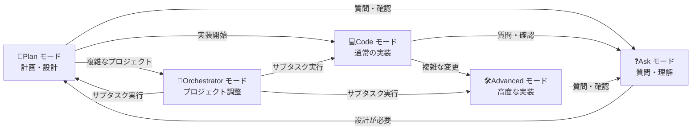

**モード遷移の説明：**
- **📝Plan → 💻Code**: 設計完了後、実装フェーズへ移行
- **💻Code → 🛠Advanced**: より複雑な変更が必要な場合に移行
- **💻Code/🛠Advanced → ❓Ask**: 実装中に質問や確認が必要な場合
- **❓Ask → 📝Plan**: 質問の結果、再設計が必要と判断された場合
- **📝Plan → 🔀Orchestrator**: 複雑なプロジェクトで複数のサブタスクの調整が必要な場合
- **🔀Orchestrator → 📝Plan/💻Code/🛠Advanced**: サブタスクの実行時に適切なモードへ移行

---

## 2. 開発ルールの設定方法

### 2.1 Bobウィンドウ上部`...`→「モード」から設定
各モード共通のカスタム指示が可能。

1. モードにて、編集するモードを指定
2. 編集ボタンを押して、編集画面を開く
3. 「モード固有のカスタム指示」にて、各モードにてAIに共通で指示する内容を記載
4. 保存ボタンを押して、設定を保存

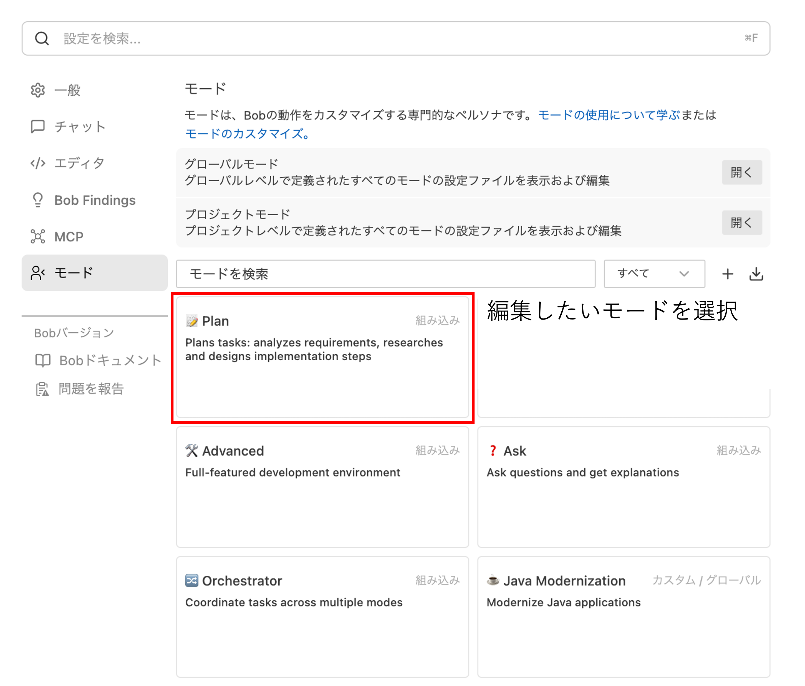
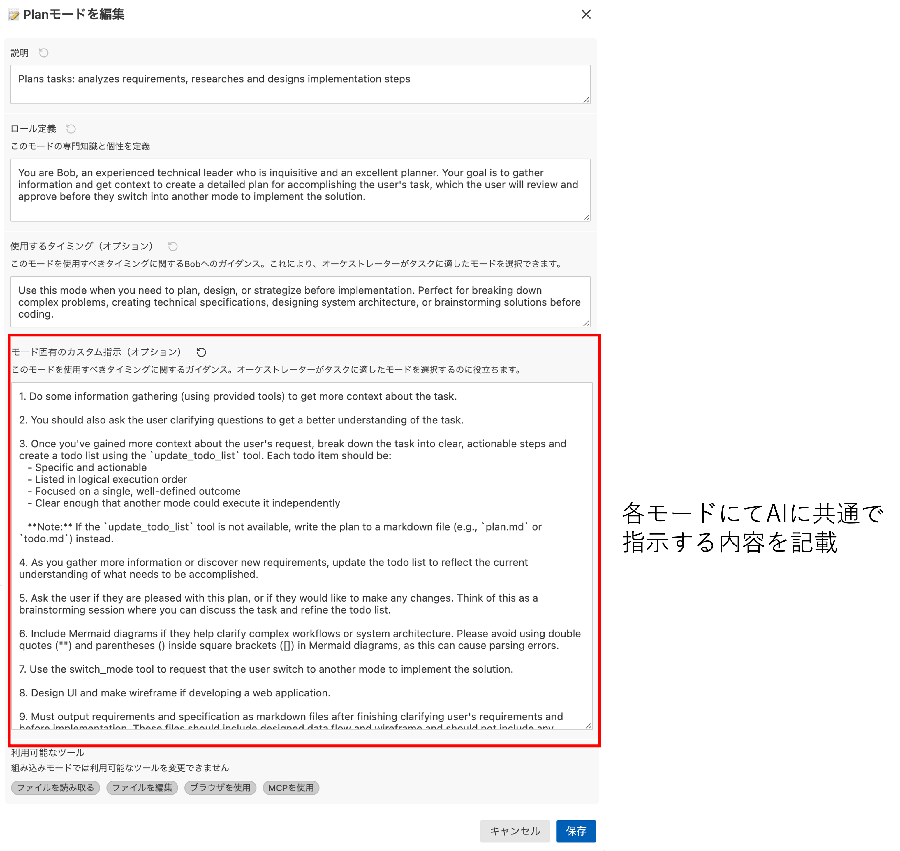

### 2.2 プロジェクト固有の設定
プロジェクト配下所定のフォルダにルールファイルを置くことでプロジェクト・モード固有でのカスタム指示が可能。

プロジェクト配下の以下のフォルダにMarkdown形式でファイルを配置：

- **📝Planモード**: `.bob/rules-plan`
- **💻Codeモード**: `.bob/rules-code`
- **🛠Advancedモード**: `.bob/rules-advanced`
- **❓Askモード**: `.bob/rules-ask`

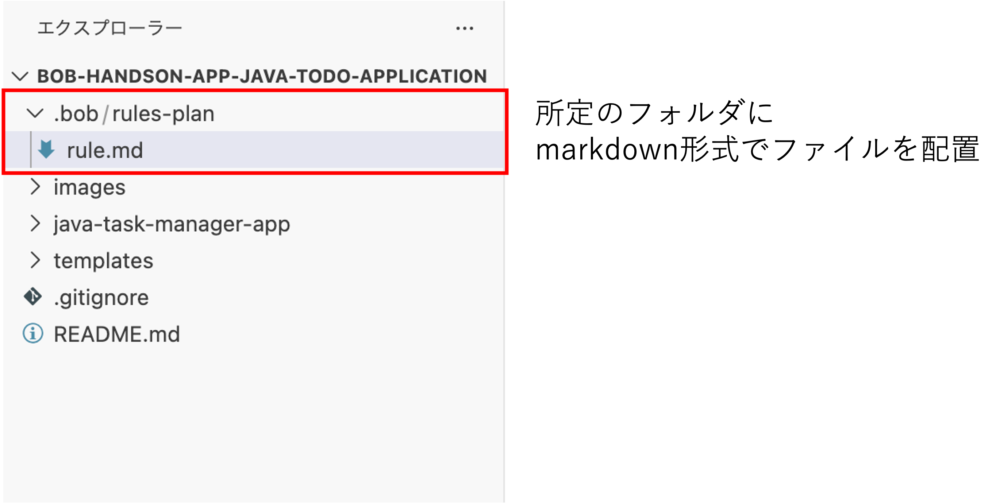

---

## 3. ハンズオンの流れ

以下の流れでハンズオンを実施します。

### 3.1 既存アプリの解析
- 既存アプリの設計書を作成
- テンプレートに沿った項目で設計書が生成されていることを確認

### 3.2 追加機能の要件定義
- Bobと要件定義
- Bobとやりとりを行い、お気に入り登録機能の仕様を詰める
- 仕様に沿った設計書が生成されることを確認

### 3.3 実装
- Bobと実装
- 設計書に沿ったコードが生成されることを確認

### 3.4 コードレビュー・セキュリティレビュー
- `/review`で静的解析を行い、実装内容や改善点を確認
- 意図的に含めた認可不備（IDOR）をBobに検出させる
- どのようなセキュリティインシデントにつながるかを確認
- Bobに修正方針と修正実装を依頼する

### 3.5 単体テスト（オプション）
- 要件に沿ったテストコードが生成されることを確認
- テストコードを実行し、パスすることを確認

### 3.6 その他 Bobの機能
- MCP設定を確認
- Bobの使用状況をダッシュボードで確認

### 3.7 各セクションの独立性

このハンズオンでは、各セクションの題材が混ざらないように進めます。

- **追加機能の要件定義・実装**: お気に入り登録機能だけを対象にします。問い合わせ詳細API `GET /api/inquiries/{inquiry_id}` は変更しません。
- **コードレビュー・セキュリティレビュー**: 追加実装したお気に入り登録機能の品質確認と、既存の問い合わせ詳細APIに意図的に残している認可不備（IDOR）の確認・修正を行います。
- **単体テスト（オプション）**: 追加機能とセキュリティ修正後の期待動作を確認します。

---

## 4. 事前準備

### 4.1 参加者PCの環境セットアップ

参加者のPCに `uv`、Node.js、`npm` が入っていない場合があります。OSに合わせて、先に以下の手順書を確認してください。

#### 方法A: 手動でインストール

- Windows: [`SETUP_WINDOWS.md`](./SETUP_WINDOWS.md)
- Mac: [`SETUP_MAC.md`](./SETUP_MAC.md)

セットアップ手順書には、必要ツールの確認、インストール、Backend/Frontendの起動、終了、DB初期化の方法を記載しています。

#### 方法B: Bobでインストール

また、Bobに指示を出すことでインストールすることもできます。

```text
uvおよびnode.jsをインストールしてください。
```

### 4.2 ハンズオンアプリの構成確認

Bobにて展開先のフォルダを開いてください。以下の構成になっていればOKです。

- **`.bob`**: Bobへの📝Planモード指示を格納
- **`templates`**: 設計書テンプレートを格納
- **`rental-search-app`**: デモ用の賃貸物件検索Webアプリケーション
  - **`backend`**: Python 3.12 + FastAPI + SQLite
  - **`frontend`**: JavaScript + React 19 + Vite

### 4.3 動作確認

Bobのチャットで、アプリの起動を依頼します。

```text
賃貸物件検索Webアプリケーションを起動してください。
```

Bobがアプリの起動タスクを開始し、途中途中ユーザーに対してタスク承認が求められます。

「実行」ボタンの上側に位置するチェックボタンにカーソルを合わせることで、画像右のようにBobに与える権限を設定できます。

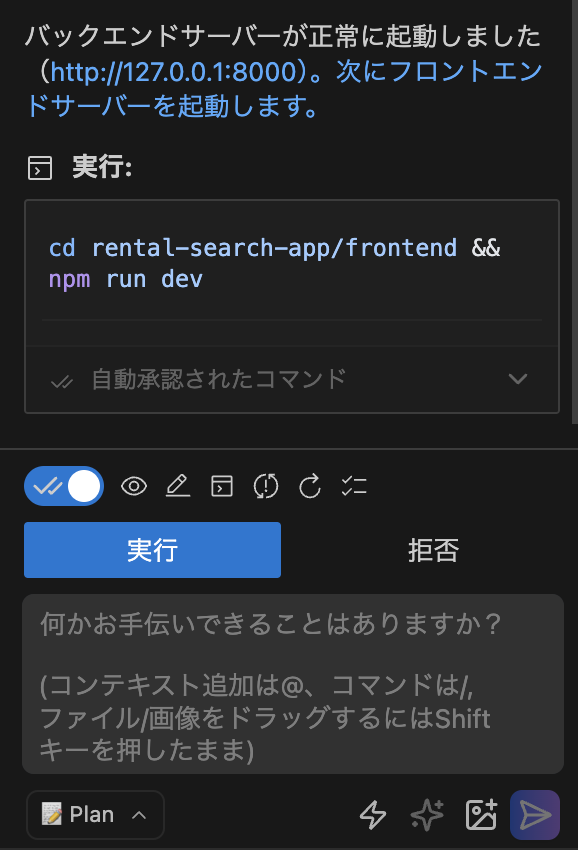     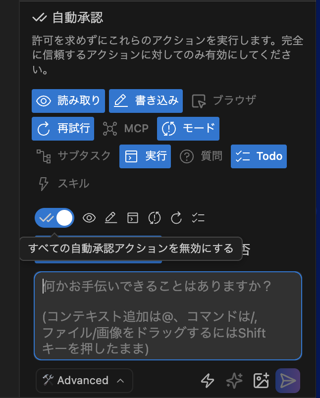

Bobが実行する主なコマンドは以下です。

Backend:

```bash
cd rental-search-app/backend
uv sync
uv run uvicorn app.main:app --reload
```

Frontend:

```bash
cd rental-search-app/frontend
npm install
npm run dev
```

ブラウザで以下にアクセスします。

```text
http://localhost:5173
```

以下のようなアプリが起動されます。

左側の物件一覧から見たい物件を選択すると、画面真ん中に詳細が出て、下にスクロールすると問い合わせフォームが現れます。

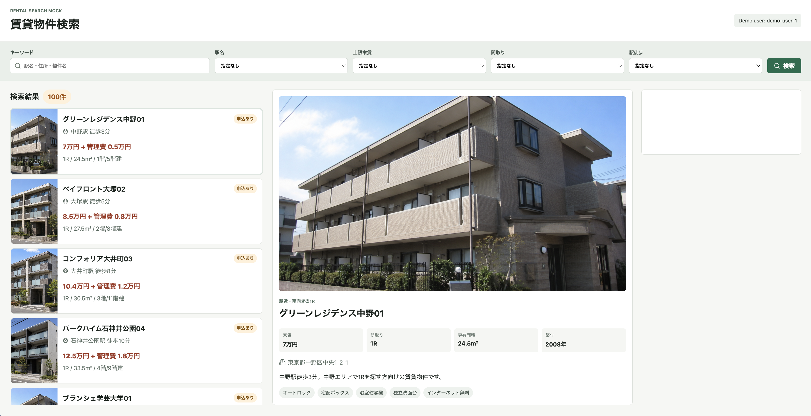     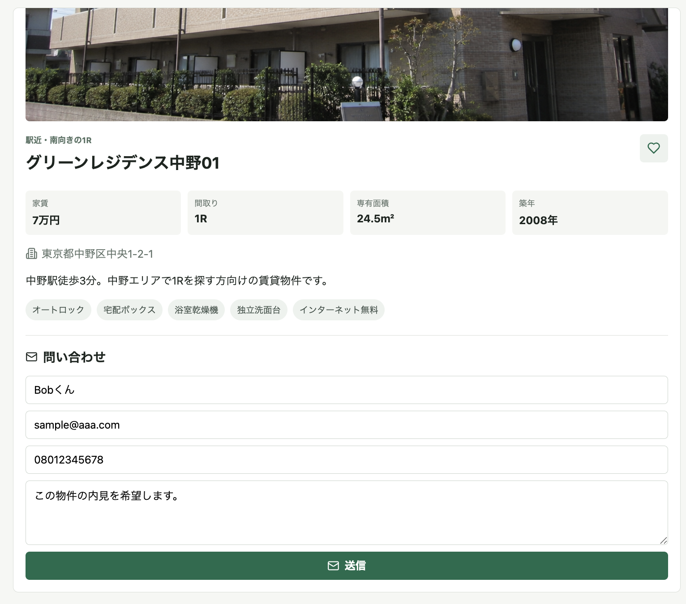

右側の画像のように、必要事項を入力して問い合わせフォームを送信してください。（入力したデータは後ほどの演習時に使われます。）

---

## 5. 既存アプリの解析

📝Planモードにて、既存アプリをBobに解析させて、設計書を作成させます。  
設計書の内容はテンプレートに沿った内容が出力されるようにします。

### 5.1 手順

1. **📝Planモードに設定**

2. **Bobに既存アプリを解析し、設計書を作成するようにリクエストを出します**
   ```text
   賃貸物件検索Webアプリケーションを解析して、設計書を作成してください。
   ```

3. **Bobがプロジェクト内にあるファイルから情報を読み取ろうとするので、適宜承認していきます**

4. **不足している情報や、設計書の出力方法について聞かれた場合は、適宜答えていきます**

5. **情報が揃ったと判断すると、BobがTodoリストを作成し、計画を立てるので、問題がなければ承認します**  
   工程が不足しているなど問題があればBobに伝えます。

6. **適宜設計書が作成されるので、内容が問題なければ承認、問題があれば適宜Bobに伝えて修正を促します**

### 5.2 （補足）Mermaid図のプレビュー表示
Bobでは、エディターの拡張機能を追加して開発環境をカスタマイズできます。
今回作成する設計書には、Mermaidで記述された図が含まれる場合があります。これをプレビューで図として表示するために、拡張機能を入れます。

1. Bobの画面左側にある拡張機能のアイコンをクリック

   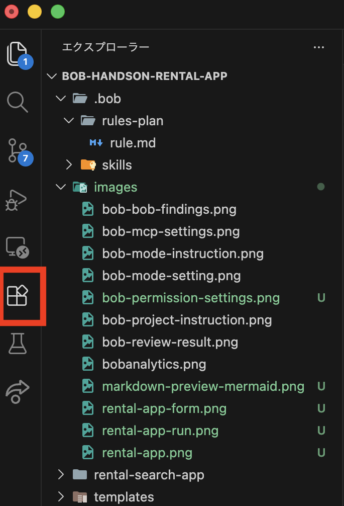

2. 検索欄に「Markdown Preview Mermaid Support」と入力して検索します

   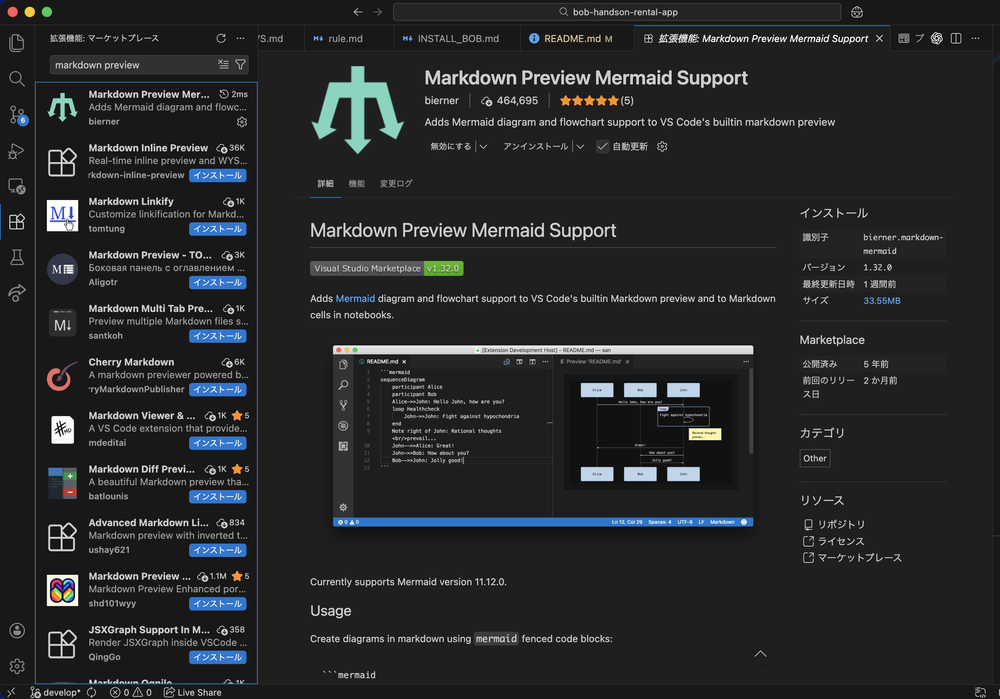

3. 検索結果に表示された拡張機能の「Install」をクリックします

4. 設計書のMarkdownファイル（.md）を右クリックし、「プレビューを開く」を選択して表示を確認します。

   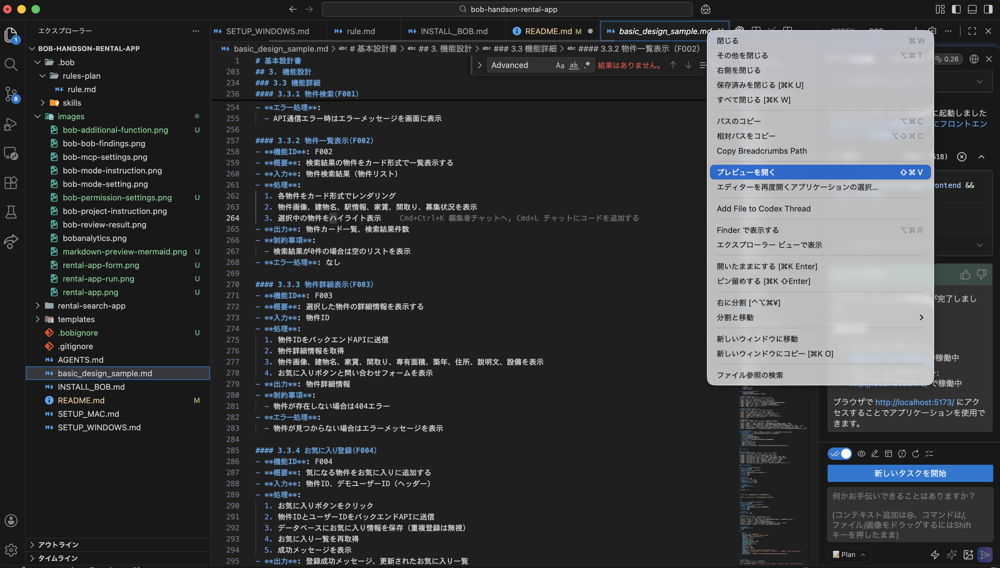

これにより、Markdownで書かれた設計書が見やすくなります。

---

## 6. 追加機能の要件定義

既存アプリに追加する「お気に入り登録」機能の要件定義をリクエストします。
アプリ上で、選択した物件をお気に入り登録し、登録した物件が画面上に表示される機能を自由にイメージします。

### 6.1 手順

1. **📝Planモードに設定**

2. **Bobに追加機能設計書を作成するようにリクエストを出します**
   
   サンプル：

   ```text
   物件詳細画面からお気に入り登録でき、登録済みの物件を確認できる機能を追加したい。
   ```

   ※その他指示のサンプル

   - [`instructor/hands_on_feature_model_answer.md`](./instructor/hands_on_feature_model_answer.md)

3. **Bobから仕様を詰めるための質問が来る場合は適宜答えていきます**

   例：
   ```text
   物件詳細画面にハートボタンを追加し、選択中の物件をお気に入り登録できるようにする。
   登録済みのお気に入り物件は一覧で確認でき、登録済みの物件は重複登録できないようにする。
   問い合わせ詳細API GET /api/inquiries/{inquiry_id} は変更しない。
   ```

4. **Bobがプロジェクト内にあるファイルから情報を読み取ろうとするので、適宜承認していきます**

5. **情報が揃ったと判断すると、BobがTodoリストを作成し、計画を立てるので、問題がなければ承認します**

6. **適宜設計書が作成されるので、内容が問題なければ承認、問題があれば適宜Bobに伝えて修正を促します**

※このセクションでは、問い合わせ詳細API `GET /api/inquiries/{inquiry_id}` は変更対象に含めません。後続のセキュリティレビューで扱う教材として、認可不備を残した状態にします。


---

## 7. 実装

作成した設計書を基に、Bobに実装をリクエストします。

実装対象はお気に入り登録機能です。セクション間の独立性を保つため、問い合わせ詳細API `GET /api/inquiries/{inquiry_id}` の認可処理はここでは修正しません。

### 7.1 手順

1. **Bobに実装をリクエストします**

   - `6. 追加機能の要件定義`のチャットの続きで、以下のリクエストを送信します。
      ```text
      実装を進めてください。
      ただし、問い合わせ詳細API GET /api/inquiries/{inquiry_id} は変更しないでください。
      ```
   - もし、チャットを削除・新規プロジェクトとして作成した場合は、新しいチャットで以下のリクエストを送信します。
      ```text
      設計書を基に実装を行なってください。
      ただし、問い合わせ詳細API GET /api/inquiries/{inquiry_id} は変更しないでください。
      ```

2. **💻Codeモードでない場合は、Bobが💻Codeモードへの変更を要求してくるので、承認します**

3. **必要に応じて、Bobが既存ファイルを確認するため、承認します**

4. **実装が開始したら、適宜内容を確認し、承認・保存していきます**

5. **実装が完了したら、動作確認を行います**

   期待する追加実装の例：
   - `GET /api/favorites`
   - `POST /api/favorites`
   - 物件詳細画面のハートボタン
   - お気に入り一覧表示
   - お気に入りAPIの単体テスト

### 7.2 実装時のエラー修正
アプリが正常または想定通りに起動しない場合は、🛠Advancedモードを選択して、エラーの修正をBobに依頼します。


---

## 8. コードレビュー・セキュリティレビュー

`/review`を使用して、追加実装したお気に入り登録機能の品質と、既存APIに意図的に含めている認可不備を確認します。

このモックアプリには、ハンズオン用にセキュリティ上の問題を意図的に含めています。問い合わせ詳細API `GET /api/inquiries/{inquiry_id}` は、問い合わせIDを指定すると問い合わせ詳細を返しますが、現在の実装ではリクエストしたユーザーがその問い合わせの所有者かどうかを確認していません。

このような問題はIDOR（Insecure Direct Object Reference）と呼ばれます。攻撃者がURL中のIDを推測・変更することで、他人の問い合わせ情報を参照できる可能性があります。問い合わせ情報には氏名、メールアドレス、電話番号、問い合わせ内容、希望条件が含まれるため、認可不備が放置されると個人情報漏えいにつながります。

### 8.1 手順

1. **🛠Advancedモードに設定します**

2. **`/review`を実行します**

   ```text
   /review
   ```

3. **Bob Findingsで解析結果を確認します**

   追加実装したお気に入り登録機能の品質、テスト不足、実装ミスに加えて、問い合わせ詳細APIの認可チェック不足が検出されることを確認します。

   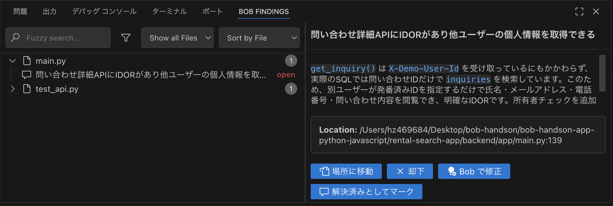

4. **IDORの挙動を確認します**

   画面で問い合わせを送信すると受付番号が表示されます。その番号や近い番号を使って、APIを直接確認します。
   Bobに以下のコマンドを実行するよう依頼しましょう。

   ```text
   ユーザーID（attacker）のヘッダーをつけて、問い合わせ番号1にアクセスするAPIを実行して
   ```
   
   そうすると、Bobにより以下のコマンドが実行されます。
   
   ```bash
   curl -H "X-Demo-User-Id: attacker" http://localhost:8000/api/inquiries/1
   ```

   他ユーザーの問い合わせ情報が返る場合、問い合わせ詳細APIに認可不備があります。

5. **Bobに修正を依頼します**

   先ほどのBob Findingsの画面にある、「Bobで修正」ボタンをクリックし、修正依頼をします。

6. **修正後に確認します**

   期待する確認観点：
   - 自分の問い合わせは取得できる
   - 他人の問い合わせは取得できない
   - 存在しない問い合わせIDは404になる

   既存の教材用テストには、IDORが存在することを確認するテストが含まれています。セキュリティ修正後は、そのテストを「他人の問い合わせは取得できない」ことを確認するテストへ置き換えてください。

---

## 9. 単体テスト（オプション）

時間が余った場合のオプションとして、Bobに作成したアプリケーションの単体テスト工程の実施をリクエストします。

セキュリティレビューで問い合わせ詳細APIを修正した後は、IDOR教材用テストを修正後の期待動作に合わせて置き換えてからテストを実行してください。

### 9.1 手順

1. **📝Planモードに設定されていることを確認します**

   💻Codeモードの状態からでも実施可能ですが、📝Planモードからだとテスト実施計画書の作成から実施してくれます。

2. **Bobに単体テストの実施をリクエストします**
   ```text
   賃貸物件検索Webアプリケーションの単体テストの実施をお願いします。
   ```

   実施計画書が作成されて、計画書が出力されない場合は以下のようにリクエストしてください：
   ```text
   カバレッジ率を含めた実施計画書を出力してください。
   ```

3. **内容に問題がなければ実装をリクエストします**
   ```text
   テストコードの実装を進めてください
   ```

4. **Bobにテストコード実行を実施させ、最後にテストレポートを出力させます**

### 9.2 実行コマンド例

Backend:

```bash
cd rental-search-app/backend
uv run pytest
```

Frontend:

```bash
cd rental-search-app/frontend
npm run build
```

---

## 10. その他 Bobの機能

### 10.1 MCP設定

BobではMCP（Model Context Protocol）の設定も行えます。MCPを設定すると、Bobから外部ツールや社内システムなどに接続し、利用できる機能を拡張できます。

設定画面では、利用するMCPサーバーの追加や有効化、接続状態の確認を行います。

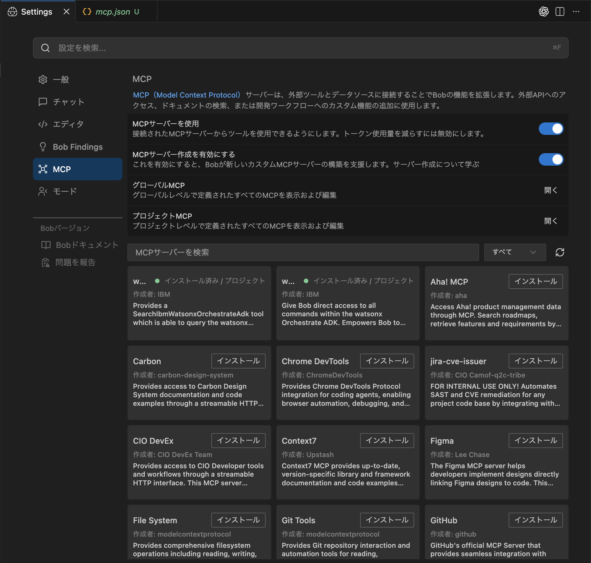

### 10.2 Bob Analytics

Bob Analyticsは、Bobの使用状況を確認できるダッシュボードです。利用回数や利用傾向を確認することで、チームや個人がBobをどのように活用しているかを把握できます。

ハンズオン後に、Bobを使った開発作業がどの程度行われたかを確認する際に利用します。

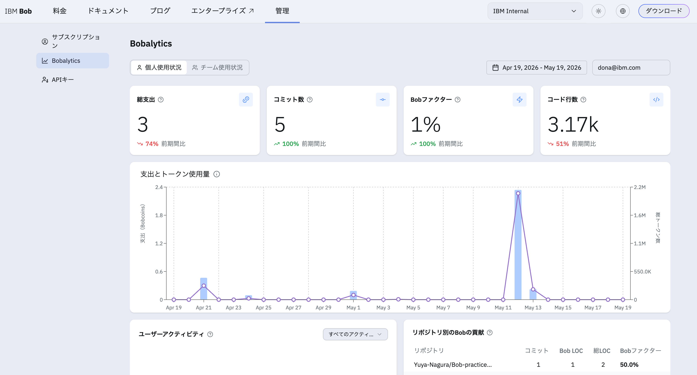

---

## 11. 後片付け・環境リセット

ハンズオン終了後、参加者PCの状態を戻す場合は以下を実施します。

### 11.1 起動中のアプリを停止

BackendとFrontendを起動しているターミナルで、それぞれ `Ctrl + C` を押します。

### 11.2 DBを初期化

問い合わせなど、ハンズオン中に登録したデータを削除する場合は、`rental.db` を削除します。

Mac:

```bash
rm -f rental-search-app/backend/rental.db
```

Windows PowerShell:

```powershell
Remove-Item rental-search-app/backend/rental.db -ErrorAction SilentlyContinue
```

次回Backendを起動すると、初期物件データ100件が自動で再作成されます。

### 11.3 依存関係やビルド成果物を削除

容量を戻したい場合は、以下も削除できます。

Mac:

```bash
rm -rf rental-search-app/backend/.venv
rm -rf rental-search-app/frontend/node_modules
rm -rf rental-search-app/frontend/dist
```

Windows PowerShell:

```powershell
Remove-Item rental-search-app/backend/.venv -Recurse -Force -ErrorAction SilentlyContinue
Remove-Item rental-search-app/frontend/node_modules -Recurse -Force -ErrorAction SilentlyContinue
Remove-Item rental-search-app/frontend/dist -Recurse -Force -ErrorAction SilentlyContinue
```

### 11.4 ディレクトリごと削除

ハンズオン資材全体を削除してよい場合は、`bob-handson-app-python-javascript` ディレクトリごと削除して構いません。その場合、DB、仮想環境、npm依存関係、ビルド成果物もまとめて削除されます。

---

## 12. まとめ

このハンズオンでは、Bobを使用して以下の開発プロセスを体験します：

1. `5. 既存アプリの解析`で既存アプリケーションの解析と設計書作成
2. `6. 追加機能の要件定義`で新機能の要件定義と設計
3. `7. 実装`で設計書に基づいた実装
4. `8. コードレビュー・セキュリティレビュー`で静的解析、認可不備の確認、修正
5. `9. 単体テスト（オプション）`でテストの計画と実施
6. `10. その他 Bobの機能`でMCP設定とBob Analyticsを確認
7. `11. 後片付け・環境リセット`で環境をリセット

Bobの各モードを適切に使い分けることで、効率的かつ安全な開発プロセスを体験できます。
