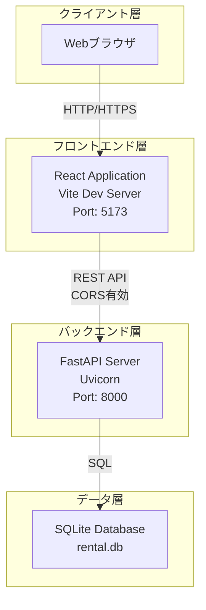
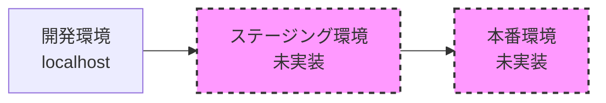
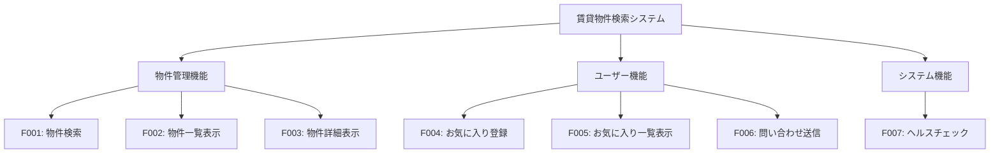
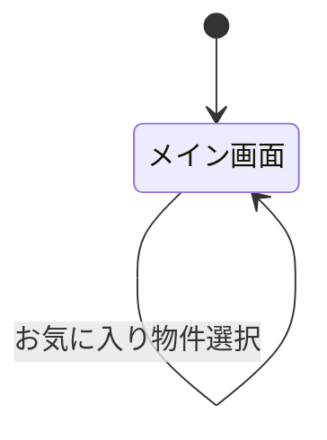
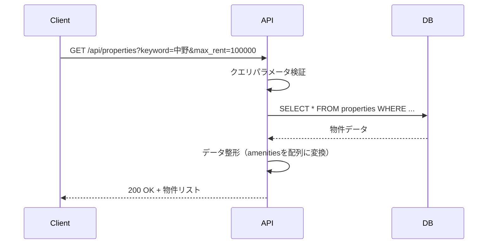
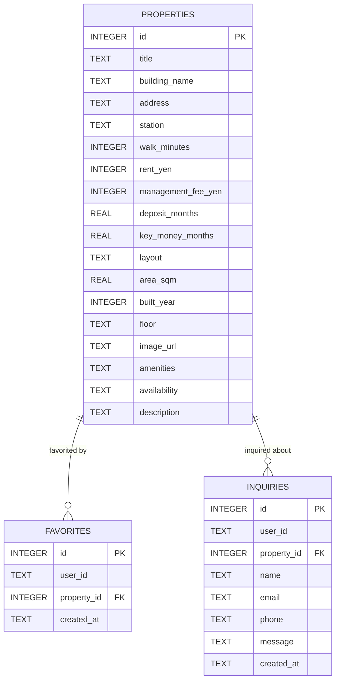

# 基本設計書

## ドキュメント管理情報
| 項目 | 内容 |
|------|------|
| プロジェクト名 | Rental Search |
| システム名 | 賃貸物件検索システム |
| バージョン | 1.0.0 |
| 作成日 | 2026-05-19 |
| 最終更新日 | 2026-05-19 |
| 作成者 | システム開発チーム |
| 承認者 | - |
| ステータス | 草案 |

## 変更履歴
| 日付 | バージョン | 変更内容 | 変更者 |
|------|------------|----------|--------|
| 2026-05-19 | 1.0.0 | 初版作成 | システム開発チーム |

---

## 1. 概要

### 1.1 目的
本設計書は、賃貸物件検索システム「Rental Search」の基本設計を定義するものである。本書は、開発チーム、テストチーム、および関係者が、システムの構造、機能、インターフェース、データ設計を理解し、実装・テストを進めるための技術仕様書として位置づけられる。

**対象読者**
- システム開発者（フロントエンド・バックエンド）
- テストエンジニア
- プロジェクトマネージャー
- システム運用担当者

### 1.2 スコープ
本設計書は、以下の範囲を対象とする：

**対象範囲**
- 賃貸物件検索機能
- 物件詳細表示機能
- お気に入り登録・管理機能
- 問い合わせ送信機能
- REST API設計
- データベース設計（論理設計）
- 画面設計
- セキュリティ設計

**対象外**
- 詳細設計（クラス設計、メソッド仕様など）
- 物理データベース設計（インデックス最適化、パーティショニングなど）
- インフラ構築手順
- 運用手順書
- ユーザーマニュアル

### 1.3 前提条件
- 要件定義書のバージョン: 本システムはデモアプリケーションとして開発
- 参照ドキュメント: 
  - [`rental-search-app/README.md`](../README.md)
  - [`rental-search-app/backend/README.md`](../backend/README.md)
  - [`rental-search-app/frontend/README.md`](../frontend/README.md)
- 開発環境: 
  - macOS / Windows
  - Python 3.11以上
  - Node.js（npm）
- 対象プラットフォーム: 
  - Webブラウザ（Chrome、Firefox、Safari、Edge最新版）
  - ローカル開発環境での動作を想定

### 1.4 用語定義
| 用語 | 定義 |
|------|------|
| 物件 | 賃貸住宅の物件情報。建物名、住所、家賃、間取りなどの属性を持つ |
| お気に入り | ユーザーが気になる物件を保存する機能 |
| 問い合わせ | 物件に対してユーザーが送信する質問や内見希望などのメッセージ |
| デモユーザー | 認証機能の簡易実装として、ヘッダーで指定するユーザー識別子 |
| 駅徒歩 | 最寄り駅から物件までの徒歩時間（分） |
| 間取り | 物件の部屋構成（1R、1LDK、2LDKなど） |
| 設備 | 物件に備わっている設備や条件（オートロック、ペット可など） |
| 募集中 | 現在入居可能な物件のステータス |
| 申込あり | 既に入居申込が入っている物件のステータス |

---
## 2. システムアーキテクチャ

### 2.1 システム構成図


### 2.2 技術スタック
| レイヤー | 技術 | バージョン | 選定理由 |
|----------|------|------------|----------|
| フロントエンド | React | 19.0.0 | モダンなUIライブラリ、コンポーネントベース開発 |
| フロントエンド | Vite | 6.0.1 | 高速な開発サーバー、HMR対応 |
| フロントエンド | lucide-react | 0.468.0 | 軽量なアイコンライブラリ |
| バックエンド | Python | 3.11+ | 型ヒント対応、高い生産性 |
| バックエンド | FastAPI | 0.115.0+ | 高速なAPI開発、自動ドキュメント生成 |
| バックエンド | Uvicorn | 0.30.0+ | ASGIサーバー、高性能 |
| バックエンド | Pydantic | 2.8.0+ | データバリデーション、型安全性 |
| データベース | SQLite | 3.x | 軽量、セットアップ不要、デモに最適 |
| パッケージ管理 | uv | latest | 高速なPythonパッケージマネージャー |
| パッケージ管理 | npm | latest | Node.jsパッケージマネージャー |
| テスト | pytest | 8.3.0+ | Pythonテストフレームワーク |

### 2.3 アーキテクチャパターン
本システムは以下のアーキテクチャパターンを採用している：

**1. クライアント・サーバーアーキテクチャ**
- フロントエンド（React）とバックエンド（FastAPI）を分離
- REST APIによる疎結合な通信
- 各層の独立した開発・デプロイが可能

**2. レイヤードアーキテクチャ（バックエンド）**
- プレゼンテーション層: FastAPIエンドポイント（[`app/main.py`](../backend/app/main.py)）
- ビジネスロジック層: エンドポイント内の処理ロジック
- データアクセス層: データベース接続・操作（[`app/database.py`](../backend/app/database.py)）
- データモデル層: Pydanticスキーマ（[`app/schemas.py`](../backend/app/schemas.py)）

**3. シングルページアプリケーション（SPA）**
- フロントエンドは単一のHTMLページで動作
- 画面遷移はクライアント側で制御
- APIを通じてデータを非同期取得

**選定理由**
- デモアプリケーションとして、シンプルで理解しやすい構成
- 開発効率が高く、保守性に優れる
- 将来的な機能拡張に対応可能

### 2.4 ディレクトリ構成
```
rental-search-app/
├── backend/                    # バックエンドアプリケーション
│   ├── app/                   # アプリケーションコード
│   │   ├── __init__.py       # パッケージ初期化
│   │   ├── main.py           # FastAPIアプリケーション、エンドポイント定義
│   │   ├── database.py       # データベース接続、初期化、シードデータ
│   │   └── schemas.py        # Pydanticスキーマ定義
│   ├── tests/                # テストコード
│   │   └── test_api.py       # APIテスト
│   ├── pyproject.toml        # Python依存関係定義
│   ├── uv.lock               # 依存関係ロックファイル
│   ├── rental.db             # SQLiteデータベースファイル
│   └── README.md             # バックエンド説明書
├── frontend/                  # フロントエンドアプリケーション
│   ├── src/                  # ソースコード
│   │   ├── main.jsx          # Reactアプリケーションエントリーポイント
│   │   └── styles.css        # スタイルシート
│   ├── public/               # 静的ファイル
│   │   └── property-images/  # 物件画像
│   ├── package.json          # npm依存関係定義
│   ├── package-lock.json     # 依存関係ロックファイル
│   ├── index.html            # HTMLエントリーポイント
│   └── README.md             # フロントエンド説明書
├── docs/                      # ドキュメント
│   └── basic_design.md       # 本設計書
└── README.md                  # プロジェクト全体説明書
```

### 2.5 デプロイメント構成
本システムはローカル開発環境での動作を想定している。



**開発環境**
- フロントエンド: `http://localhost:5173`
- バックエンド: `http://localhost:8000`
- データベース: ローカルファイル（`rental.db`）

**注意事項**
- 本システムはデモアプリケーションのため、ステージング環境・本番環境は未実装
- 実運用する場合は、以下の対応が必要：
  - データベースをPostgreSQL等に変更
  - 認証・認可機能の実装
  - HTTPS対応
  - 環境変数による設定管理
  - ロギング・監視の実装

---
## 3. 機能設計

### 3.1 機能一覧
| 機能ID | 機能名 | 概要 | 優先度 | 実装状況 |
|--------|--------|------|--------|----------|
| F001 | 物件検索 | キーワード、駅名、家賃、間取り、駅徒歩で物件を検索 | 高 | 実装済 |
| F002 | 物件一覧表示 | 検索条件に合致する物件をカード形式で一覧表示 | 高 | 実装済 |
| F003 | 物件詳細表示 | 選択した物件の詳細情報を表示 | 高 | 実装済 |
| F004 | お気に入り登録 | 気になる物件をお気に入りに追加 | 中 | 実装済 |
| F005 | お気に入り一覧表示 | 登録したお気に入り物件を一覧表示 | 中 | 実装済 |
| F006 | 問い合わせ送信 | 物件に対する問い合わせを送信 | 中 | 実装済 |
| F007 | ヘルスチェック | APIサーバーの稼働状態確認 | 低 | 実装済 |

### 3.2 機能構成図


### 3.3 機能詳細

#### 3.3.1 物件検索（F001）
- **機能ID**: F001
- **概要**: ユーザーが指定した条件で物件を検索する
- **入力**: 
  - キーワード（任意）: 駅名、住所、物件名などの文字列
  - 駅名（任意）: プルダウンから選択
  - 上限家賃（任意）: 9万円以下、14万円以下、20万円以下、30万円以下
  - 間取り（任意）: 1R、1LDK、2LDK
  - 駅徒歩（任意）: 5分以内、10分以内、15分以内
- **処理**: 
  1. 検索フォームから入力値を取得
  2. バックエンドAPIに検索条件を送信
  3. 検索条件に合致する物件をデータベースから取得
  4. 募集中の物件を優先し、家賃の安い順にソート
- **出力**: 検索条件に合致する物件リスト
- **制約事項**: 
  - すべての検索条件は任意（AND条件で絞り込み）
  - 条件未指定の場合は全物件を返す
- **エラー処理**: 
  - API通信エラー時はエラーメッセージを画面に表示

#### 3.3.2 物件一覧表示（F002）
- **機能ID**: F002
- **概要**: 検索結果の物件をカード形式で一覧表示する
- **入力**: 物件検索結果（物件リスト）
- **処理**: 
  1. 各物件をカード形式でレンダリング
  2. 物件画像、建物名、駅情報、家賃、間取り、募集状況を表示
  3. 選択中の物件をハイライト表示
- **出力**: 物件カード一覧、検索結果件数
- **制約事項**: 
  - 検索結果が0件の場合は空のリストを表示
- **エラー処理**: なし

#### 3.3.3 物件詳細表示（F003）
- **機能ID**: F003
- **概要**: 選択した物件の詳細情報を表示する
- **入力**: 物件ID
- **処理**: 
  1. 物件IDをバックエンドAPIに送信
  2. 物件詳細情報を取得
  3. 物件画像、建物名、家賃、間取り、専有面積、築年、住所、説明文、設備を表示
  4. お気に入りボタンと問い合わせフォームを表示
- **出力**: 物件詳細情報
- **制約事項**: 
  - 物件が存在しない場合は404エラー
- **エラー処理**: 
  - 物件が見つからない場合はエラーメッセージを表示

#### 3.3.4 お気に入り登録（F004）
- **機能ID**: F004
- **概要**: 気になる物件をお気に入りに追加する
- **入力**: 物件ID、デモユーザーID（ヘッダー）
- **処理**: 
  1. お気に入りボタンをクリック
  2. 物件IDとユーザーIDをバックエンドAPIに送信
  3. データベースにお気に入り情報を保存（重複登録は無視）
  4. お気に入り一覧を再取得
  5. 成功メッセージを表示
- **出力**: 登録成功メッセージ、更新されたお気に入り一覧
- **制約事項**: 
  - 同じ物件を複数回登録しても1件のみ保存
  - 物件が存在しない場合は404エラー
- **エラー処理**: 
  - 物件が見つからない場合はエラーメッセージを表示

#### 3.3.5 お気に入り一覧表示（F005）
- **機能ID**: F005
- **概要**: 登録したお気に入り物件を一覧表示する
- **入力**: デモユーザーID（ヘッダー）
- **処理**: 
  1. ユーザーIDをバックエンドAPIに送信
  2. ユーザーのお気に入り物件を取得
  3. 登録日時の新しい順に表示
  4. 物件をクリックすると詳細を表示
- **出力**: お気に入り物件リスト、件数
- **制約事項**: 
  - お気に入りが0件の場合はメッセージを表示
- **エラー処理**: 
  - API通信エラー時はエラーメッセージを表示

#### 3.3.6 問い合わせ送信（F006）
- **機能ID**: F006
- **概要**: 物件に対する問い合わせを送信する
- **入力**: 
  - 物件ID
  - 氏名（必須、1文字以上）
  - メールアドレス（必須、メール形式）
  - 電話番号（必須、8文字以上）
  - 問い合わせ内容（必須、1文字以上）
  - デモユーザーID（ヘッダー）
- **処理**: 
  1. 問い合わせフォームに入力
  2. 送信ボタンをクリック
  3. バリデーションチェック
  4. バックエンドAPIに問い合わせ情報を送信
  5. データベースに問い合わせ情報を保存
  6. 受付番号を含む成功メッセージを表示
  7. フォームをクリア
- **出力**: 問い合わせ受付番号、成功メッセージ
- **制約事項**: 
  - すべての項目が必須
  - メールアドレスは形式チェック
  - 電話番号は8文字以上
  - 物件が存在しない場合は404エラー
- **エラー処理**: 
  - バリデーションエラー時は具体的なエラーメッセージを表示
  - 物件が見つからない場合はエラーメッセージを表示

#### 3.3.7 ヘルスチェック（F007）
- **機能ID**: F007
- **概要**: APIサーバーの稼働状態を確認する
- **入力**: なし
- **処理**: 
  1. `/api/health` エンドポイントにGETリクエスト
  2. サーバーの稼働状態を返す
- **出力**: `{"status": "ok"}`
- **制約事項**: なし
- **エラー処理**: サーバーが停止している場合は接続エラー

---
## 4. 画面設計

### 4.1 画面一覧
| 画面ID | 画面名 | 画面種別 | 機能ID | URL | 備考 |
|--------|--------|----------|--------|-----|------|
| SC001 | メイン画面 | 統合画面 | F001-F006 | / | 検索、一覧、詳細、お気に入り、問い合わせを含む |

### 4.2 画面遷移図


**注意事項**
- 本システムはシングルページアプリケーション（SPA）のため、画面遷移は発生しない
- すべての操作は同一画面内で完結する

### 4.3 画面レイアウト

#### 4.3.1 メイン画面（SC001）
- **画面ID**: SC001
- **画面種別**: 統合画面（検索、一覧、詳細、お気に入りを含む）
- **アクセス権限**: なし（認証不要）
- **URL**: `/`（`http://localhost:5173`）

**ワイヤーフレーム**
```
+------------------------------------------------------------------+
|  ヘッダー                                                          |
|  [Rental Search Mock]  賃貸物件検索        [Demo user: demo-user-1] |
+------------------------------------------------------------------+
|  検索フォーム                                                       |
|  [キーワード] [駅名▼] [上限家賃▼] [間取り▼] [駅徒歩▼] [検索ボタン]    |
+------------------------------------------------------------------+
|  [エラー/成功メッセージ表示エリア]                                   |
+------------------------------------------------------------------+
|                                                                  |
|  +------------------+  +---------------------------+  +--------+ |
|  | 検索結果         |  | 物件詳細                   |  |お気に入り| |
|  | (物件一覧)       |  |                           |  |        | |
|  |                  |  | [物件画像]                 |  | 物件1  | |
|  | [物件カード1]    |  | 建物名                     |  | 物件2  | |
|  | [物件カード2]    |  | 家賃、間取り、面積、築年    |  | 物件3  | |
|  | [物件カード3]    |  | 住所                       |  |        | |
|  | ...              |  | 説明文                     |  |        | |
|  |                  |  | [設備タグ]                 |  |        | |
|  |                  |  |                           |  |        | |
|  |                  |  | 問い合わせフォーム          |  |        | |
|  |                  |  | [氏名]                     |  |        | |
|  |                  |  | [メールアドレス]            |  |        | |
|  |                  |  | [電話番号]                 |  |        | |
|  |                  |  | [問い合わせ内容]            |  |        | |
|  |                  |  | [送信ボタン]               |  |        | |
|  +------------------+  +---------------------------+  +--------+ |
|                                                                  |
+------------------------------------------------------------------+
```

**画面構成要素**

1. **ヘッダー**
   - アプリケーション名: "Rental Search Mock"
   - タイトル: "賃貸物件検索"
   - デモユーザー表示: "Demo user: demo-user-1"

2. **検索フォーム**
   - キーワード入力（テキスト）
   - 駅名選択（プルダウン）
   - 上限家賃選択（プルダウン）
   - 間取り選択（プルダウン）
   - 駅徒歩選択（プルダウン）
   - 検索ボタン

3. **メッセージ表示エリア**
   - エラーメッセージ（赤色）
   - 成功メッセージ（緑色）

4. **検索結果エリア（左側）**
   - 検索結果件数表示
   - 物件カード一覧（スクロール可能）

5. **物件詳細エリア（中央）**
   - 物件画像
   - 物件情報（建物名、家賃、間取り、面積、築年、住所、説明文）
   - 設備タグ
   - お気に入りボタン
   - 問い合わせフォーム

6. **お気に入りエリア（右側）**
   - お気に入り件数表示
   - お気に入り物件リスト（スクロール可能）

**画面項目（検索フォーム）**
| 項目ID | 項目名 | 種別 | 必須 | 初期値 | 検証ルール |
|--------|--------|------|------|--------|------------|
| SF001 | キーワード | テキスト入力 | × | 空文字 | なし |
| SF002 | 駅名 | プルダウン | × | 指定なし | 10駅から選択 |
| SF003 | 上限家賃 | プルダウン | × | 指定なし | 9万/14万/20万/30万円以下 |
| SF004 | 間取り | プルダウン | × | 指定なし | 1R/1LDK/2LDK |
| SF005 | 駅徒歩 | プルダウン | × | 指定なし | 5分/10分/15分以内 |
| SF006 | 検索ボタン | ボタン | - | - | - |

**画面項目（問い合わせフォーム）**
| 項目ID | 項目名 | 種別 | 必須 | 初期値 | 検証ルール |
|--------|--------|------|------|--------|------------|
| IF001 | 氏名 | テキスト入力 | ○ | 空文字 | 1文字以上 |
| IF002 | メールアドレス | メール入力 | ○ | 空文字 | メール形式 |
| IF003 | 電話番号 | テキスト入力 | ○ | 空文字 | 8文字以上 |
| IF004 | 問い合わせ内容 | テキストエリア | ○ | 空文字 | 1文字以上 |
| IF005 | 送信ボタン | ボタン | - | - | - |

**画面アクション**
| アクションID | アクション名 | トリガー | 処理内容 | 遷移先 |
|--------------|--------------|----------|----------|--------|
| AC001 | 検索実行 | 検索ボタンクリック | 検索条件でAPI呼び出し、結果を表示 | なし |
| AC002 | 物件選択 | 物件カードクリック | 物件詳細をAPI取得、詳細エリアに表示 | なし |
| AC003 | お気に入り追加 | お気に入りボタンクリック | お気に入りAPI呼び出し、成功メッセージ表示 | なし |
| AC004 | 問い合わせ送信 | 送信ボタンクリック | バリデーション後、問い合わせAPI呼び出し | なし |
| AC005 | お気に入り物件選択 | お気に入りリストアイテムクリック | 物件詳細をAPI取得、詳細エリアに表示 | なし |

### 4.4 UI/UX設計方針
- **デザインシステム**: カスタムCSS（[`src/styles.css`](../frontend/src/styles.css)）
- **レスポンシブ対応**: デスクトップ向け（モバイル対応は未実装）
- **アクセシビリティ**: 
  - セマンティックHTML使用
  - フォーム要素にlabel関連付け
  - ボタンにaria-label設定（一部）
- **ブラウザ対応**: Chrome、Firefox、Safari、Edge最新版
- **カラースキーム**: 
  - プライマリカラー: 青系
  - 成功メッセージ: 緑系
  - エラーメッセージ: 赤系
- **アイコン**: lucide-react使用（Search、Heart、Mail、Building2、TrainFront）

---
## 5. API設計

### 5.1 API一覧
| API ID | エンドポイント | メソッド | 概要 | 認証 | 機能ID |
|--------|----------------|----------|------|------|--------|
| API001 | /api/health | GET | ヘルスチェック | 不要 | F007 |
| API002 | /api/properties | GET | 物件一覧取得・検索 | 不要 | F001, F002 |
| API003 | /api/properties/{property_id} | GET | 物件詳細取得 | 不要 | F003 |
| API004 | /api/favorites | GET | お気に入り一覧取得 | 簡易認証 | F005 |
| API005 | /api/favorites | POST | お気に入り登録 | 簡易認証 | F004 |
| API006 | /api/inquiries | POST | 問い合わせ登録 | 簡易認証 | F006 |
| API007 | /api/inquiries/{inquiry_id} | GET | 問い合わせ詳細取得 | 簡易認証 | - |

### 5.2 API詳細仕様

#### 5.2.1 ヘルスチェック（API001）
- **API ID**: API001
- **エンドポイント**: `/api/health`
- **HTTPメソッド**: GET
- **概要**: APIサーバーの稼働状態を確認する
- **認証**: 不要
- **認可**: なし

**リクエスト**
- **ヘッダー**: なし
- **パスパラメータ**: なし
- **クエリパラメータ**: なし
- **リクエストボディ**: なし

**レスポンス**
- **成功時（200 OK）**
```json
{
  "status": "ok"
}
```

- **エラー時**: なし（サーバー停止時は接続エラー）

**実装**: [`app/main.py`](../backend/app/main.py:39-41)

---

#### 5.2.2 物件一覧取得・検索（API002）
- **API ID**: API002
- **エンドポイント**: `/api/properties`
- **HTTPメソッド**: GET
- **概要**: 検索条件に合致する物件一覧を取得する
- **認証**: 不要
- **認可**: なし

**リクエスト**
- **ヘッダー**: なし

- **クエリパラメータ**
| パラメータ名 | 型 | 必須 | デフォルト値 | 説明 |
|--------------|-----|------|--------------|------|
| keyword | string | × | なし | キーワード検索（物件名、建物名、住所、駅名に部分一致） |
| station | string | × | なし | 駅名（部分一致） |
| max_rent | integer | × | なし | 上限家賃（円）、0以上 |
| layout | string | × | なし | 間取り（完全一致）、例: "1R", "1LDK", "2LDK" |
| max_walk_minutes | integer | × | なし | 駅徒歩上限（分）、0以上 |

**レスポンス**
- **成功時（200 OK）**
```json
[
  {
    "id": 1,
    "title": "駅近・南向きの1R",
    "building_name": "グリーンレジデンス中野01",
    "address": "東京都中野区中央1-2-1",
    "station": "中野駅",
    "walk_minutes": 3,
    "rent_yen": 78000,
    "management_fee_yen": 5000,
    "deposit_months": 0.0,
    "key_money_months": 0.0,
    "layout": "1R",
    "area_sqm": 24.5,
    "built_year": 2008,
    "floor": "1階/5階建",
    "image_url": "/property-images/property-images-1.png",
    "amenities": ["オートロック", "宅配ボックス", "浴室乾燥機", "独立洗面台", "インターネット無料"],
    "availability": "募集中",
    "description": "中野駅徒歩3分。中野エリアで1Rを探す方向けの賃貸物件です。"
  }
]
```

- **エラー時**
| ステータスコード | 説明 | レスポンス例 |
|------------------|------|--------------|
| 422 | バリデーションエラー | `{"detail": [{"loc": ["query", "max_rent"], "msg": "ensure this value is greater than or equal to 0"}]}` |

**シーケンス図**


**実装**: [`app/main.py`](../backend/app/main.py:44-74)

---

#### 5.2.3 物件詳細取得（API003）
- **API ID**: API003
- **エンドポイント**: `/api/properties/{property_id}`
- **HTTPメソッド**: GET
- **概要**: 指定した物件IDの詳細情報を取得する
- **認証**: 不要
- **認可**: なし

**リクエスト**
- **ヘッダー**: なし

- **パスパラメータ**
| パラメータ名 | 型 | 必須 | 説明 |
|--------------|-----|------|------|
| property_id | integer | ○ | 物件ID |

**レスポンス**
- **成功時（200 OK）**
```json
{
  "id": 1,
  "title": "駅近・南向きの1R",
  "building_name": "グリーンレジデンス中野01",
  "address": "東京都中野区中央1-2-1",
  "station": "中野駅",
  "walk_minutes": 3,
  "rent_yen": 78000,
  "management_fee_yen": 5000,
  "deposit_months": 0.0,
  "key_money_months": 0.0,
  "layout": "1R",
  "area_sqm": 24.5,
  "built_year": 2008,
  "floor": "1階/5階建",
  "image_url": "/property-images/property-images-1.png",
  "amenities": ["オートロック", "宅配ボックス", "浴室乾燥機", "独立洗面台", "インターネット無料"],
  "availability": "募集中",
  "description": "中野駅徒歩3分。中野エリアで1Rを探す方向けの賃貸物件です。"
}
```

- **エラー時**
| ステータスコード | 説明 | レスポンス例 |
|------------------|------|--------------|
| 404 | 物件が見つからない | `{"detail": "Property not found"}` |

**実装**: [`app/main.py`](../backend/app/main.py:77-85)

---

#### 5.2.4 お気に入り一覧取得（API004）
- **API ID**: API004
- **エンドポイント**: `/api/favorites`
- **HTTPメソッド**: GET
- **概要**: ユーザーのお気に入り物件一覧を取得する
- **認証**: 簡易認証（ヘッダー）
- **認可**: なし

**リクエスト**
- **ヘッダー**
| ヘッダー名 | 型 | 必須 | デフォルト値 | 説明 |
|------------|-----|------|--------------|------|
| X-Demo-User-Id | string | × | "demo-user-1" | デモユーザーID |

**レスポンス**
- **成功時（200 OK）**
```json
[
  {
    "id": 1,
    "title": "駅近・南向きの1R",
    "building_name": "グリーンレジデンス中野01",
    "address": "東京都中野区中央1-2-1",
    "station": "中野駅",
    "walk_minutes": 3,
    "rent_yen": 78000,
    "management_fee_yen": 5000,
    "deposit_months": 0.0,
    "key_money_months": 0.0,
    "layout": "1R",
    "area_sqm": 24.5,
    "built_year": 2008,
    "floor": "1階/5階建",
    "image_url": "/property-images/property-images-1.png",
    "amenities": ["オートロック", "宅配ボックス", "浴室乾燥機", "独立洗面台", "インターネット無料"],
    "availability": "募集中",
    "description": "中野駅徒歩3分。中野エリアで1Rを探す方向けの賃貸物件です。"
  }
]
```

**実装**: [`app/main.py`](../backend/app/main.py:88-103)

---

#### 5.2.5 お気に入り登録（API005）
- **API ID**: API005
- **エンドポイント**: `/api/favorites`
- **HTTPメソッド**: POST
- **概要**: 物件をお気に入りに登録する
- **認証**: 簡易認証（ヘッダー）
- **認可**: なし

**リクエスト**
- **ヘッダー**
| ヘッダー名 | 型 | 必須 | デフォルト値 | 説明 |
|------------|-----|------|--------------|------|
| Content-Type | string | ○ | - | "application/json" |
| X-Demo-User-Id | string | × | "demo-user-1" | デモユーザーID |

- **リクエストボディ**
```json
{
  "property_id": 1
}
```

| フィールド名 | 型 | 必須 | 説明 |
|--------------|-----|------|------|
| property_id | integer | ○ | 物件ID |

**レスポンス**
- **成功時（200 OK）**
```json
{
  "status": "saved"
}
```

- **エラー時**
| ステータスコード | 説明 | レスポンス例 |
|------------------|------|--------------|
| 404 | 物件が見つからない | `{"detail": "Property not found"}` |
| 422 | バリデーションエラー | `{"detail": [{"loc": ["body", "property_id"], "msg": "field required"}]}` |

**実装**: [`app/main.py`](../backend/app/main.py:106-121)

---

#### 5.2.6 問い合わせ登録（API006）
- **API ID**: API006
- **エンドポイント**: `/api/inquiries`
- **HTTPメソッド**: POST
- **概要**: 物件に対する問い合わせを登録する
- **認証**: 簡易認証（ヘッダー）
- **認可**: なし

**リクエスト**
- **ヘッダー**
| ヘッダー名 | 型 | 必須 | デフォルト値 | 説明 |
|------------|-----|------|--------------|------|
| Content-Type | string | ○ | - | "application/json" |
| X-Demo-User-Id | string | × | "demo-user-1" | デモユーザーID |

- **リクエストボディ**
```json
{
  "property_id": 1,
  "name": "山田太郎",
  "email": "yamada@example.com",
  "phone": "090-1234-5678",
  "message": "内見を希望します。"
}
```

| フィールド名 | 型 | 必須 | 検証ルール | 説明 |
|--------------|-----|------|------------|------|
| property_id | integer | ○ | - | 物件ID |
| name | string | ○ | 1文字以上 | 氏名 |
| email | string | ○ | メール形式 | メールアドレス |
| phone | string | ○ | 8文字以上 | 電話番号 |
| message | string | ○ | 1文字以上 | 問い合わせ内容 |

**レスポンス**
- **成功時（201 Created）**
```json
{
  "id": 1,
  "user_id": "demo-user-1",
  "property_id": 1,
  "name": "山田太郎",
  "email": "yamada@example.com",
  "phone": "090-1234-5678",
  "message": "内見を希望します。",
  "created_at": "2026-05-19 14:00:00"
}
```

- **エラー時**
| ステータスコード | 説明 | レスポンス例 |
|------------------|------|--------------|
| 404 | 物件が見つからない | `{"detail": "Property not found"}` |
| 422 | バリデーションエラー | `{"detail": [{"loc": ["body", "email"], "msg": "value is not a valid email address"}]}` |

**実装**: [`app/main.py`](../backend/app/main.py:124-152)

---

#### 5.2.7 問い合わせ詳細取得（API007）
- **API ID**: API007
- **エンドポイント**: `/api/inquiries/{inquiry_id}`
- **HTTPメソッド**: GET
- **概要**: 指定した問い合わせIDの詳細情報を取得する
- **認証**: 簡易認証（ヘッダー）
- **認可**: なし

**リクエスト**
- **ヘッダー**
| ヘッダー名 | 型 | 必須 | デフォルト値 | 説明 |
|------------|-----|------|--------------|------|
| X-Demo-User-Id | string | × | "demo-user-1" | デモユーザーID |

- **パスパラメータ**
| パラメータ名 | 型 | 必須 | 説明 |
|--------------|-----|------|------|
| inquiry_id | integer | ○ | 問い合わせID |

**レスポンス**
- **成功時（200 OK）**
```json
{
  "id": 1,
  "user_id": "demo-user-1",
  "property_id": 1,
  "name": "山田太郎",
  "email": "yamada@example.com",
  "phone": "090-1234-5678",
  "message": "内見を希望します。",
  "created_at": "2026-05-19 14:00:00"
}
```

- **エラー時**
| ステータスコード | 説明 | レスポンス例 |
|------------------|------|--------------|
| 404 | 問い合わせが見つからない | `{"detail": "Inquiry not found"}` |

**実装**: [`app/main.py`](../backend/app/main.py:155-166)

---

### 5.3 API共通仕様
- **ベースURL**: `http://localhost:8000`（開発環境）
- **認証方式**: 簡易認証（`X-Demo-User-Id`ヘッダー）
  - 本番環境では JWT または OAuth2.0 への移行を推奨
- **レート制限**: なし（デモアプリのため未実装）
- **バージョニング**: なし（将来的に `/api/v1/` 等の導入を検討）
- **エラーレスポンス形式**: 
  - FastAPIのデフォルト形式
  - `{"detail": "エラーメッセージ"}` または `{"detail": [バリデーションエラー配列]}`
- **CORS設定**: 
  - 許可オリジン: `http://localhost:5173`, `http://127.0.0.1:5173`
  - 許可メソッド: すべて
  - 許可ヘッダー: すべて
  - 認証情報: 許可
- **Content-Type**: `application/json`
- **文字コード**: UTF-8

---
## 6. データベース設計（論理設計）

### 6.1 ER図


### 6.2 テーブル定義

#### 6.2.1 物件テーブル（properties）
- **テーブル物理名**: properties
- **テーブル論理名**: 物件
- **概要**: 賃貸物件の基本情報を格納する

| # | カラム物理名 | カラム論理名 | データ型 | 桁数 | NULL | デフォルト値 | 制約 | 説明 |
|---|--------------|--------------|----------|------|------|--------------|------|------|
| 1 | id | 物件ID | INTEGER | - | × | - | PK | 主キー |
| 2 | title | タイトル | TEXT | - | × | - | | 物件の特徴を表すタイトル |
| 3 | building_name | 建物名 | TEXT | - | × | - | | マンション・アパート名 |
| 4 | address | 住所 | TEXT | - | × | - | | 物件の所在地 |
| 5 | station | 最寄り駅 | TEXT | - | × | - | | 最寄り駅名 |
| 6 | walk_minutes | 駅徒歩 | INTEGER | - | × | - | | 駅から徒歩何分か |
| 7 | rent_yen | 家賃 | INTEGER | - | × | - | | 月額家賃（円） |
| 8 | management_fee_yen | 管理費 | INTEGER | - | × | - | | 月額管理費（円） |
| 9 | deposit_months | 敷金 | REAL | - | × | - | | 敷金（家賃の何ヶ月分か） |
| 10 | key_money_months | 礼金 | REAL | - | × | - | | 礼金（家賃の何ヶ月分か） |
| 11 | layout | 間取り | TEXT | - | × | - | | 間取りタイプ（1R、1LDK等） |
| 12 | area_sqm | 専有面積 | REAL | - | × | - | | 専有面積（平方メートル） |
| 13 | built_year | 築年 | INTEGER | - | × | - | | 建築年 |
| 14 | floor | 階数 | TEXT | - | × | - | | 部屋の階数と建物の総階数 |
| 15 | image_url | 画像URL | TEXT | - | × | - | | 物件画像のURL |
| 16 | amenities | 設備 | TEXT | - | × | - | | 設備・条件（カンマ区切り） |
| 17 | availability | 募集状況 | TEXT | - | × | - | | 募集中/申込あり |
| 18 | description | 説明文 | TEXT | - | × | - | | 物件の説明 |

**インデックス**
| インデックス名 | 種別 | カラム | 説明 |
|----------------|------|--------|------|
| - | - | - | 現在インデックスなし（デモアプリのため） |

**外部キー制約**: なし

**備考**
- 物件データは初期化時に100件のサンプルデータが自動生成される
- `amenities`はカンマ区切りの文字列で格納され、API応答時に配列に変換される

---

#### 6.2.2 お気に入りテーブル（favorites）
- **テーブル物理名**: favorites
- **テーブル論理名**: お気に入り
- **概要**: ユーザーがお気に入り登録した物件を管理する

| # | カラム物理名 | カラム論理名 | データ型 | 桁数 | NULL | デフォルト値 | 制約 | 説明 |
|---|--------------|--------------|----------|------|------|--------------|------|------|
| 1 | id | お気に入りID | INTEGER | - | × | - | PK, AUTO_INCREMENT | 主キー |
| 2 | user_id | ユーザーID | TEXT | - | × | - | | デモユーザーID |
| 3 | property_id | 物件ID | INTEGER | - | × | - | FK | 物件テーブルへの外部キー |
| 4 | created_at | 登録日時 | TEXT | - | × | CURRENT_TIMESTAMP | | お気に入り登録日時 |

**インデックス**
| インデックス名 | 種別 | カラム | 説明 |
|----------------|------|--------|------|
| - | - | - | 現在インデックスなし（デモアプリのため） |

**外部キー制約**
| 制約名 | 参照先テーブル | 参照先カラム | ON DELETE | ON UPDATE |
|--------|----------------|--------------|-----------|-----------|
| - | properties | id | - | - |

**ユニーク制約**
- `(user_id, property_id)`: 同一ユーザーが同じ物件を複数回お気に入り登録できないようにする

**備考**
- `user_id`は簡易認証のため文字列型
- 本番環境では整数型のユーザーIDを使用することを推奨

---

#### 6.2.3 問い合わせテーブル（inquiries）
- **テーブル物理名**: inquiries
- **テーブル論理名**: 問い合わせ
- **概要**: 物件に対する問い合わせ情報を格納する

| # | カラム物理名 | カラム論理名 | データ型 | 桁数 | NULL | デフォルト値 | 制約 | 説明 |
|---|--------------|--------------|----------|------|------|--------------|------|------|
| 1 | id | 問い合わせID | INTEGER | - | × | - | PK, AUTO_INCREMENT | 主キー |
| 2 | user_id | ユーザーID | TEXT | - | × | - | | デモユーザーID |
| 3 | property_id | 物件ID | INTEGER | - | × | - | FK | 物件テーブルへの外部キー |
| 4 | name | 氏名 | TEXT | - | × | - | | 問い合わせ者の氏名 |
| 5 | email | メールアドレス | TEXT | - | × | - | | 問い合わせ者のメールアドレス |
| 6 | phone | 電話番号 | TEXT | - | × | - | | 問い合わせ者の電話番号 |
| 7 | message | 問い合わせ内容 | TEXT | - | × | - | | 問い合わせメッセージ |
| 8 | created_at | 登録日時 | TEXT | - | × | CURRENT_TIMESTAMP | | 問い合わせ登録日時 |

**インデックス**
| インデックス名 | 種別 | カラム | 説明 |
|----------------|------|--------|------|
| - | - | - | 現在インデックスなし（デモアプリのため） |

**外部キー制約**
| 制約名 | 参照先テーブル | 参照先カラム | ON DELETE | ON UPDATE |
|--------|----------------|--------------|-----------|-----------|
| - | properties | id | - | - |

**備考**
- 問い合わせは削除機能がないため、すべて保存される
- 本番環境では問い合わせステータス（未対応/対応中/完了）の追加を検討

---

### 6.3 データモデル設計方針
- **正規化レベル**: 第3正規形
  - 物件、お気に入り、問い合わせを独立したテーブルに分離
  - `amenities`は非正規化（カンマ区切り文字列）だが、デモアプリとして許容
- **命名規則**: 
  - テーブル名: 小文字、複数形（例: properties, favorites）
  - カラム名: 小文字、スネークケース（例: user_id, created_at）
- **文字コード**: UTF-8
- **照合順序**: デフォルト（SQLiteのデフォルト照合順序）
- **データベースファイル**: `rental.db`（SQLiteファイル）
- **初期化処理**: 
  - アプリケーション起動時に自動的にテーブル作成
  - 物件データが0件の場合、100件のサンプルデータを自動生成
  - 実装: [`app/database.py`](../backend/app/database.py:16-66)

**将来の改善案**
- PostgreSQL等のRDBMSへの移行
- `amenities`テーブルの正規化（多対多関係）
- インデックスの追加（検索性能向上）
- パーティショニング（大量データ対応）

---
## 7. 外部インターフェース設計

### 7.1 外部システム連携一覧
本システムは外部システムとの連携を行わない。

| IF ID | 連携先システム | 連携方式 | 方向 | 頻度 | データ形式 |
|-------|----------------|----------|------|------|------------|
| - | なし | - | - | - | - |

### 7.2 外部インターフェース詳細
該当なし。

**将来の拡張案**
- 不動産情報サイトとのAPI連携
- メール送信サービス（問い合わせ通知）
- 地図サービスAPI（物件位置表示）
- 画像ストレージサービス（物件画像管理）

---

## 8. セキュリティ設計

### 8.1 認証・認可
- **認証方式**: 簡易認証（`X-Demo-User-Id`ヘッダー）
  - デモアプリのため、ヘッダーでユーザーIDを指定
  - 本番環境では JWT または OAuth2.0 への移行が必要
- **認可方式**: なし
  - すべてのユーザーがすべての機能にアクセス可能
  - 本番環境ではロールベースアクセス制御（RBAC）の実装を推奨
- **セッション管理**: なし（ステートレス）
- **パスワードポリシー**: なし（認証機能未実装）

### 8.2 データ保護
- **暗号化**: 
  - 通信: 開発環境ではHTTP（本番環境ではTLS 1.2以上を推奨）
  - 保存データ: 暗号化なし（デモアプリのため）
- **個人情報保護**: 
  - 問い合わせ情報（氏名、メールアドレス、電話番号）は平文で保存
  - 本番環境では個人情報の暗号化を推奨
- **機密情報の取り扱い**: 
  - 機密情報は含まれない（デモデータのみ）

### 8.3 セキュリティ対策
| 脅威 | 対策 | 実装状況 |
|------|------|----------|
| SQLインジェクション | プリペアドステートメント使用 | 実装済 |
| XSS | Reactの自動エスケープ | 実装済 |
| CSRF | なし | 未実装（本番環境では必要） |
| 不正アクセス | なし | 未実装（認証機能が簡易的） |
| DDoS攻撃 | なし | 未実装（レート制限なし） |

**セキュリティ上の注意事項**
- 本システムはデモアプリケーションであり、本番環境での使用は推奨されない
- 本番環境では以下の対策が必要：
  - 適切な認証・認可機能の実装
  - HTTPS通信の強制
  - CSRFトークンの実装
  - レート制限の実装
  - 入力値の厳格なバリデーション
  - セキュリティヘッダーの設定

### 8.4 監査ログ
- **記録対象**: なし（デモアプリのため未実装）
- **保存期間**: -
- **アクセス制限**: -

**本番環境での推奨事項**
- ユーザーアクション（ログイン、お気に入り登録、問い合わせ送信）のログ記録
- API呼び出しのログ記録
- エラー発生時の詳細ログ記録

---

## 9. 非機能要件設計

### 9.1 性能設計
| 項目 | 目標値 | 測定方法 | 現状 |
|------|--------|----------|------|
| レスポンスタイム | 1秒以内 | ブラウザ開発者ツール | 未測定（デモアプリ） |
| スループット | - | - | 未測定 |
| 同時接続数 | 10ユーザー程度 | - | ローカル開発環境想定 |

**性能上の制約**
- SQLiteを使用しているため、大量データ・高負荷には不向き
- 本番環境ではPostgreSQL等への移行を推奨

### 9.2 可用性設計
- **稼働率目標**: 設定なし（デモアプリ）
- **冗長化構成**: なし
- **障害時の対応**: 手動再起動

**本番環境での推奨事項**
- 99.9%以上の稼働率目標
- ロードバランサーによる冗長化
- 自動フェイルオーバー

### 9.3 拡張性設計
- **スケーラビリティ**: 
  - 垂直スケーリング: サーバースペック向上で対応可能
  - 水平スケーリング: データベースがSQLiteのため困難
- **将来の拡張性**: 
  - 機能追加は比較的容易（モジュール構造）
  - データベース移行が必要な場合は大規模な改修が必要

### 9.4 保守性設計
- **ログ設計**: 
  - Uvicornの標準ログ出力
  - エラー発生時のスタックトレース出力
- **監視項目**: 
  - APIサーバーの稼働状態（ヘルスチェック）
  - エラーログの監視
- **バックアップ**: 
  - データベースファイル（`rental.db`）の定期バックアップを推奨
  - 現状は手動バックアップのみ

### 9.5 移植性設計
- **環境依存性**: 
  - Python 3.11以上
  - Node.js（npm）
  - macOS / Windows / Linux対応
- **データ移行**: 
  - SQLiteファイルのコピーで移行可能
  - 他のRDBMSへの移行にはスキーマ変換が必要

---

## 10. バッチ処理設計

### 10.1 バッチ処理一覧
本システムにはバッチ処理は実装されていない。

| バッチID | バッチ名 | 実行タイミング | 処理概要 | 想定処理時間 |
|----------|----------|----------------|----------|--------------|
| - | なし | - | - | - |

### 10.2 バッチ処理詳細
該当なし。

**将来の拡張案**
- 古い問い合わせデータのアーカイブ処理（月次）
- 物件情報の更新処理（日次）
- 統計データの集計処理（日次）

---

## 11. エラー処理設計

### 11.1 エラー分類
| エラーレベル | 説明 | 対応方針 |
|--------------|------|----------|
| FATAL | システム継続不可 | サーバー停止、管理者通知（未実装） |
| ERROR | 処理失敗 | エラーログ記録、ユーザーへエラーメッセージ表示 |
| WARNING | 警告 | ログ記録（現状は最小限） |
| INFO | 情報 | ログ記録（Uvicornの標準ログ） |

### 11.2 エラーコード体系
FastAPIのデフォルトHTTPステータスコードを使用。

| HTTPステータス | エラーメッセージ | 原因 | 対処方法 |
|----------------|------------------|------|----------|
| 400 | Bad Request | リクエストパラメータ不正 | パラメータを確認して再送信 |
| 404 | Property not found | 物件が存在しない | 正しい物件IDを指定 |
| 404 | Inquiry not found | 問い合わせが存在しない | 正しい問い合わせIDを指定 |
| 422 | Validation Error | バリデーションエラー | 入力値を確認して修正 |
| 500 | Internal Server Error | サーバー内部エラー | サーバーログを確認、管理者に連絡 |

### 11.3 例外処理方針
- **例外のキャッチ方針**: 
  - FastAPIの自動例外処理を活用
  - データベースエラーは適切にハンドリング
  - 予期しないエラーは500エラーとして返す
- **ログ出力方針**: 
  - エラー発生時はスタックトレースを含めてログ出力
  - Uvicornの標準ログ機能を使用
- **ユーザーへの通知方針**: 
  - フロントエンドでエラーメッセージを画面に表示
  - 技術的な詳細は隠蔽し、ユーザーフレンドリーなメッセージを表示

**エラーメッセージの日本語化**
- フロントエンド側で英語のエラーメッセージを日本語に変換
- 実装: [`src/main.jsx`](../frontend/src/main.jsx:25-43) の `validationMessageFor` 関数

---

## 12. テスト設計（基本方針）

### 12.1 テスト戦略
- **テストレベル**: 
  - 単体テスト: バックエンドAPIのテスト（pytest）
  - 結合テスト: 未実装
  - システムテスト: 手動テスト
  - 受入テスト: 未実装
- **テスト手法**: 
  - ブラックボックステスト（API動作確認）
  - ホワイトボックステスト（コードカバレッジ）
- **テストツール**: 
  - pytest（バックエンド）
  - httpx（HTTPクライアント）
  - 手動テスト（フロントエンド）

### 12.2 テスト観点
| テスト種別 | 観点 | 実施タイミング |
|------------|------|----------------|
| 機能テスト | 各API機能の正常動作確認 | 開発時 |
| 異常系テスト | エラーハンドリングの確認 | 開発時 |
| 性能テスト | 未実施 | - |
| セキュリティテスト | 未実施 | - |
| ユーザビリティテスト | 手動確認 | 開発時 |

### 12.3 テストデータ
- **テストデータ作成方針**: 
  - データベース初期化時に自動生成される100件のサンプルデータを使用
  - テスト用の追加データは手動で作成
- **本番データの使用**: 不可（デモデータのみ）

**テスト実装状況**
- バックエンドAPIテスト: 実装済（[`tests/test_api.py`](../backend/tests/test_api.py)）
- フロントエンドテスト: 未実装

---

## 13. 付録

### 13.1 参考資料
- FastAPI公式ドキュメント: https://fastapi.tiangolo.com/
- React公式ドキュメント: https://react.dev/
- Vite公式ドキュメント: https://vitejs.dev/
- SQLite公式ドキュメント: https://www.sqlite.org/docs.html
- Pydantic公式ドキュメント: https://docs.pydantic.dev/

### 13.2 用語集
| 用語 | 説明 |
|------|------|
| SPA | Single Page Application。単一のHTMLページで動作するWebアプリケーション |
| REST API | REpresentational State Transfer API。HTTPプロトコルを使用したAPI設計スタイル |
| CORS | Cross-Origin Resource Sharing。異なるオリジン間でのリソース共有を可能にする仕組み |
| ASGI | Asynchronous Server Gateway Interface。非同期対応のPython Webサーバーインターフェース |
| HMR | Hot Module Replacement。コード変更時にページをリロードせずに更新する機能 |
| Pydantic | Pythonのデータバリデーションライブラリ |
| lucide-react | Reactで使用できるアイコンライブラリ |
| uv | 高速なPythonパッケージマネージャー |

### 13.3 レビュー記録
| 日付 | レビュアー | 指摘事項 | 対応状況 |
|------|------------|----------|----------|
| - | - | - | - |

---

**以上**